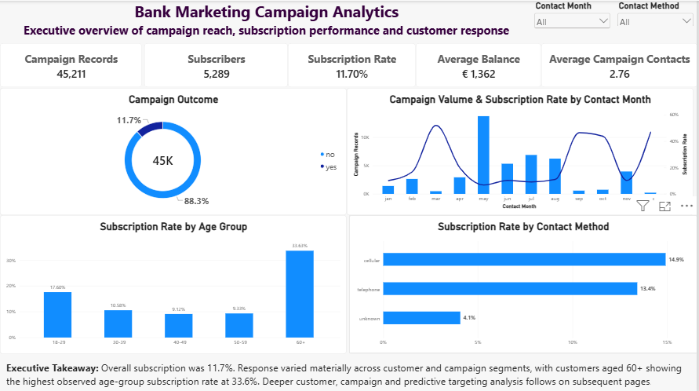

# Bank Marketing Analytics & Customer Propensity Modelling
End-to-end bank marketing analytics and predictive modelling project using
**Python, pandas, scikit-learn, Random Forest and Power BI**.

The project analyses **45,211 bank marketing campaign records** to understand
customer subscription behaviour, evaluate campaign effectiveness, and develop
a propensity-based targeting approach for term-deposit marketing.




## Project Overview
The objective of this project was to combine descriptive, diagnostic and
predictive analytics to answer three key business questions:

- Which customer segments show the strongest subscription response?
- Which campaign characteristics are associated with better performance?
- Can machine learning help prioritise higher-propensity campaign prospects?

The project follows a complete analytics workflow from raw data profiling and
cleaning through feature engineering, exploratory analysis, predictive modelling,
threshold optimisation, propensity scoring and Power BI dashboard development.

---

## Business Objective

## Dataset
**Source:** UCI Bank Marketing Dataset

**Campaign records:** 45,211

**Original source fields:** 17

**Target variable:** Term-deposit subscription

- `yes` = customer subscribed
- `no` = customer did not subscribe

The dataset contains customer demographic, financial and campaign-related
information such as age, occupation, account balance, housing loan,
personal loan, contact channel, campaign frequency and previous campaign outcome.

---

## Tools & Technologies

| Area | Tools |
|---|---|
| Programming | Python |
| Data Processing | pandas, NumPy |
| Machine Learning | scikit-learn |
| Models | Logistic Regression, Random Forest |
| Visualisation | Matplotlib, Power BI |
| Business Intelligence | Power BI, DAX |
| Model Persistence | joblib |
| Version Control | Git, GitHub |
| Development Environment | PyCharm |

---


## Analytical Workflow
```text
Raw UCI Data
      ↓
Data Profiling & Quality Audit
      ↓
Data Cleaning
      ↓
Feature Engineering
      ↓
Exploratory Data Analysis
      ↓
Business KPI Analysis
      ↓
Model Preparation
      ↓
Logistic Regression
      ↓
Random Forest
      ↓
Model Comparison
      ↓
Threshold Optimisation
      ↓
5-Fold Out-of-Fold Propensity Scoring
      ↓
Power BI Dashboard
```

## Key Business Results
| Metric                             | Result |
| ---------------------------------- | -----: |
| Campaign Records                   | 45,211 |
| Subscribers                        |  5,289 |
| Overall Subscription Rate          | 11.70% |
| Priority Target Records            |  5,905 |
| Priority Target Share              | 13.06% |
| Priority Subscriber Capture        | 48.63% |
| High Propensity Subscriber Capture | 70.64% |
| Top Decile Subscriber Capture      | 41.58% |

Customer age

Customers aged 60+ recorded the highest observed subscription rate at 33.6%,
while the 30–39 age group generated the largest absolute subscriber volume.

Account balance

Higher balance bands showed stronger observed response than customers with
negative balances.

Loan profile

Customers with no existing housing or personal loans showed the strongest
subscription response among the analysed loan-profile groups.

Previous campaign history

Customers with a successful previous campaign outcome recorded an observed
subscription rate of approximately 64.7%.

Contact frequency

Subscription rate declined from approximately 14.8% for one campaign contact
to 5.8% for six or more contacts, suggesting diminishing returns from
repeated contact.

## Predictive Modelling
Two classification models were evaluated using the same train/test split.
| Metric    | Logistic Regression | Random Forest |
| --------- | ------------------: | ------------: |
| Accuracy  |              89.32% |        81.42% |
| Precision |              66.20% |        33.51% |
| Recall    |              17.77% |        59.74% |
| F1 Score  |              28.02% |        42.93% |
| ROC-AUC   |              77.18% |        79.13% |

Although Logistic Regression produced higher accuracy and precision,
the Random Forest model was selected because it substantially improved
subscriber recall, F1 score and overall probability-ranking performance.


## Threshold Optimisation
The default classification threshold of 0.50 was compared with alternative
thresholds using a validation sample.

A threshold of:

0.60

was selected based on the highest validation F1 score.

On the untouched test set:

Metric	Default 0.50	Optimised 0.60
Accuracy	81.42%	86.83%
Precision	33.51%	44.34%
Recall	59.74%	49.24%
F1 Score	42.93%	46.66%
ROC-AUC	79.13%	79.13%
Targeting Rate	20.86%	12.99%

The optimised threshold produced a more selective targeting population while
improving precision and F1 score.

## Propensity Scoring
Historical campaign records were scored using 5-fold out-of-fold predictions.

This ensured that each historical record received its propensity score from a
model that had not been trained on that same record.

Priority Target Result

Using the validated 0.60 threshold:

13.06% of campaign records were classified as Priority Targets.
These records contained 48.63% of all historical subscribers.
Priority Targets achieved approximately 3.72× lift versus the overall campaign rate.
Propensity Decile Result
Top 10% → captured 41.58% of subscribers
Top 20% → captured 58.25%
Top 30% → captured 68.24%
This demonstrates how propensity ranking can support campaign-capacity planning.

The highest-ranked:

## Power BI Dashboard
### 1. Executive Campaign Overview
Overall campaign performance, subscription rate, age-group response,
contact method and monthly campaign activity.
### 2. Customer & Financial Profile
Customer response across age, occupation, account balance and loan profiles.
### 3. Campaign Performance & Contact Strategy
Analysis of contact method, campaign frequency, previous campaign history,
contact month and call-duration patterns.
### 4. Predictive Targeting & Model Performance
Random Forest model performance, propensity segmentation, subscriber capture,
model comparison and predictive feature importance.
### 5. Business Recommendations & Methodology
Management recommendations, model summary, limitations and the complete
analytical workflow.

```
## Repository Structure
bank-marketing-analytics-propensity-modeling/
│
├── data/
│   ├── raw/
│   └── processed/
│
├── models/
│
├── powerbi/
│   └── Project_4_Bank_Marketing_Analytics.pbix
│
├── reports/
│   └── model_charts/
│
├── screenshots/
│   ├── 01_Executive_Campaign_Overview.png
│   ├── 02_Customer_Financial_Profile.png
│   ├── 03_Campaign_Performance_Contact_Strategy.png
│   ├── 04_Predictive_Targeting_Model_Performance.png
│   └── 05_Business_Recommendations_Methodology.png
│
├── scripts/
│   ├── 00_environment_test.py
│   ├── 01_data_profile.py
│   ├── 02_data_quality_audit.py
│   ├── 03_data_cleaning.py
│   ├── 04_feature_engineering.py
│   ├── 05_exploratory_analysis.py
│   ├── 06_business_kpi_insights.py
│   ├── 07_model_preparation.py
│   ├── 08_logistic_regression.py
│   ├── 09_random_forest.py
│   ├── 10_threshold_optimization.py
│   └── 11_propensity_scoring.py
│
├── .gitignore
├── README.md
└── requirements.txt
```

## Methodology & Data Leakage Control
One important modelling decision was the exclusion of:

duration
contact_duration_minutes

from the pre-contact predictive models.

Call duration is only known after a marketing interaction has occurred.
Including it would introduce data leakage and create unrealistic model
performance.

Duration was therefore retained only for descriptive campaign analysis.

## Limitations
The source does not provide a reliable original unique customer identifier.
Campaign records should therefore not automatically be interpreted as unique customers.
A complete conventional date/year variable is unavailable.
Month-level results should not be treated as a full longitudinal time series.
Observed relationships represent associations and do not establish causality.
Propensity scores support targeting decisions but do not guarantee subscription.
Model performance should be monitored if customer behaviour or campaign processes change.

## How to Run
Install the required Python packages:

pip install -r requirements.txt

Then run the scripts sequentially:

00_environment_test.py
01_data_profile.py
02_data_quality_audit.py
03_data_cleaning.py
04_feature_engineering.py
05_exploratory_analysis.py
06_business_kpi_insights.py
07_model_preparation.py
08_logistic_regression.py
09_random_forest.py
10_threshold_optimization.py
11_propensity_scoring.py

The final Power BI-ready dataset is generated as:

data/processed/bank_marketing_scored.csv

## Project Skills
Python | pandas | NumPy | scikit-learn | Logistic Regression | Random Forest |
Machine Learning | Predictive Analytics | Propensity Modelling | Power BI | DAX |
Data Cleaning | Feature Engineering | Data Visualisation | Banking Analytics


